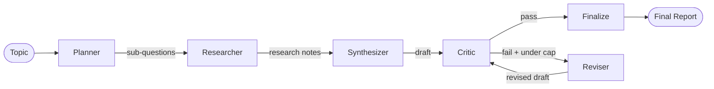

# Research Agent

A LangGraph-based multi-agent pipeline that takes a research topic, autonomously plans sub-questions, searches the web, drafts a cited report, critiques the draft against a rubric, and iteratively revises it until it passes or exhausts its revision budget.

Built to demonstrate multi-agent orchestration and iterative self-correction with LangGraph, Groq, and Tavily.

---

## Architecture

```
topic
  |
planner_node        splits topic into up to 4 sub-questions (Groq, JSON output)
  |
research_node       Tavily search per sub-question (2 results each);
  |                 LLM-summarises each source into 2-3 sentences
synthesizer_node    drafts a markdown report from research notes;
  |                 numbered [1][2] citation style + "## Sources" list
critic_node         rubric check: citation format, sources-list consistency,
  |                 uncited claims, sub-question coverage
  |                 returns {"pass": bool, "issues": [...]}
  |
  +-- pass, or iteration cap (2) reached --> finalize_node --> END
  |
  +-- fail, under cap --> reviser_node --> back to critic_node
```



---

## Evaluation Results

Evaluated across 11 topics (1 topic hit the Groq daily token quota mid-run).
Citation coverage measured with a deterministic regex-based checker — no LLM involved.

| Metric | Result |
|:---|:---|
| Topics completed | 11 / 12 |
| Passed critique | 10 / 11 |
| Persistent failures | 1 (solid-state EV batteries — genuine synthesizer limitation) |
| Orphaned citations | 0 across all runs |
| Unused sources | 0 across all runs |

**Per-topic results (post abbreviation-checker fix):**

| Topic | Pass | Iterations | Coverage |
|:---|:---:|:---:|:---:|
| Effects of remote work on employee productivity | Yes | 0 | 100% |
| The impact of social media use on adolescent mental health | Yes | 0 | 100% |
| How mRNA vaccines trigger an immune response | Yes | 0 | 91.7% |
| The current state of solid-state EV battery technology | No | 2 | 77.8% |
| The economics of vertical farming in urban environments | Yes | 0 | 83.3% |
| Preservation challenges for early video game source code | Yes | 0 | 90.0% |
| Global efforts to regulate AI-generated deepfakes | Yes | 0 | 80.0% |
| The state of lab-grown meat commercialization | Yes | 0 | 100% |
| The causes of the 2008 global financial crisis | Yes | 0 | 100% |
| How the printing press changed information spread in Europe | Yes | 0 | 100% |
| Research on the cognitive effects of bilingualism in older adults | Yes | 1 | 81.8% |
| The environmental impact of asteroid mining proposals | — | — | Hit daily quota |

**Known limitation:** the solid-state EV battery topic fails because the synthesizer generates specific numerical claims (patent counts, production timelines) without anchoring citations, and the reviser does not correct this within the two-iteration cap. Citation *accuracy* (whether a cited source actually supports the claim) is not checked automatically — that requires human spot-checking.

---

## Setup

### Prerequisites

- Python 3.11+
- A [Groq](https://console.groq.com) API key
- A [Tavily](https://tavily.com) API key

### Local

```bash
git clone https://github.com/<your-username>/research-agent.git
cd research-agent

python -m venv venv
source venv/bin/activate
pip install -r requirements.txt

cp .env.example .env
# Edit .env and add your GROQ_API_KEY and TAVILY_API_KEY

python app.py
# Open http://localhost:7860
```

### Rate limits (Groq free tier)

- 8,000 tokens per minute (input + output combined)
- 200,000 tokens per day

A single research run consumes approximately 15,000–20,000 tokens. The pipeline enforces a 20-second delay between eval topics to stay under the per-minute cap.

---

## Project Structure

```
research-agent/
├── .env.example
├── requirements.txt
├── app.py                  # Gradio UI (Phase 5)
├── graph/
│   ├── state.py            # ResearchState TypedDict
│   ├── nodes.py            # planner, researcher, synthesizer, critic, reviser, finalize
│   └── build_graph.py      # StateGraph wiring and conditional routing
├── tools/
│   ├── llm.py              # Groq client wrapper
│   └── search.py           # Tavily search wrapper
└── eval/
    ├── citation_checker.py # Deterministic regex citation coverage checker
    ├── run_eval.py         # Full eval harness
    └── test_topics.py      # 12 evaluation topics
```

---

## Running the Eval Harness

```bash
source venv/bin/activate
python -m eval.run_eval
```

Results are written to `eval/results_<timestamp>.md`.

To re-run a subset of topics only (e.g. to re-verify previously failing topics without consuming the full daily quota), modify `TEST_TOPICS` in `eval/test_topics.py` or pass a filtered list directly.

---

## Tech Stack

| Component | Library |
|:---|:---|
| Agent orchestration | [LangGraph](https://github.com/langchain-ai/langgraph) |
| LLM inference | [Groq](https://groq.com) (`openai/gpt-oss-120b`) |
| Web search | [Tavily](https://tavily.com) |
| UI | [Gradio](https://gradio.app) |
| Citation checking | Custom regex (no LLM) |
